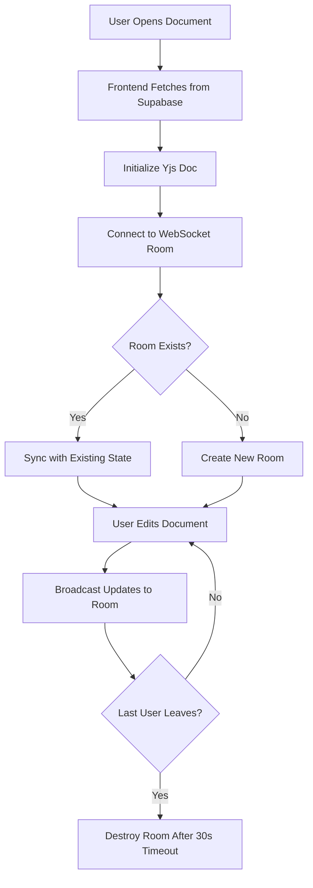
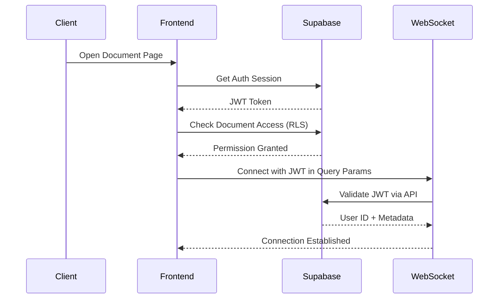
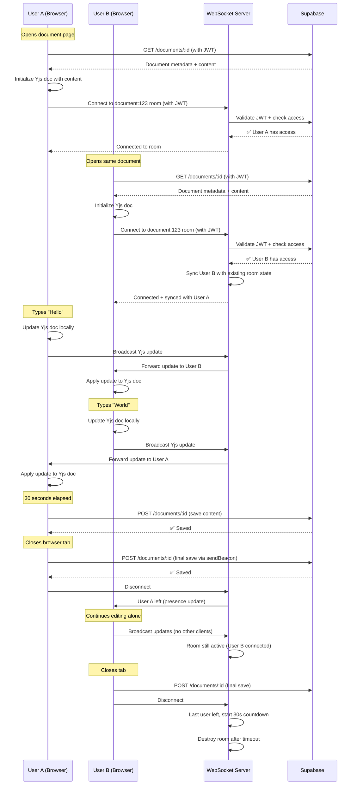

# WebSocket Server Architecture for SynkDocs

## Executive Summary

The **WebSocket server** (using `y-websocket` + Yjs CRDT) handles **ephemeral real-time collaboration state**, while **Supabase** owns **persistent data and authorization**. This separation ensures:
- WebSocket server is stateless and horizontally scalable
- Supabase enforces security via RLS policies
- Data survives WebSocket server restarts

---

## 1. Responsibility Boundaries

### **WebSocket Server (y-websocket) SHOULD:**

✅ **Real-time Synchronization**
- Broadcast Yjs document updates between connected clients
- Maintain in-memory CRDT state during active editing sessions
- Handle conflict resolution via Yjs automatic merging

✅ **Presence Awareness**
- Track which users are currently editing (cursor positions, selections)
- Broadcast awareness updates (who's online, typing indicators)
- Manage room membership (user joins/leaves)

✅ **Ephemeral State Management**
- Keep document state in memory for active sessions only
- Serve as the "source of truth" **while users are editing**
- Provide low-latency updates (<50ms)

✅ **Room Management**
- Map document IDs to WebSocket rooms
- Isolate documents (users in doc A can't see doc B's updates)
- Handle client disconnections gracefully

---

### **WebSocket Server SHOULD NOT:**

❌ **Store Persistent Data**
- No database writes (that's Supabase's job)
- No permanent document storage
- No user metadata storage

❌ **Handle Authorization**
- No permission checks (trust Supabase auth token validation)
- No RLS enforcement (Supabase does this)
- No user role management

❌ **Manage Document Metadata**
- No title updates
- No ownership tracking
- No deleted_at timestamps

❌ **Handle Comments or Versions**
- Comments → Supabase PostgreSQL
- Version snapshots → Supabase PostgreSQL
- Collaborator lists → Supabase PostgreSQL

---

### **Supabase SHOULD:**

✅ **Persistent Storage**
- Store document snapshots (throttled saves from clients)
- Store comments, versions, collaborators
- Store user profiles and authentication

✅ **Authorization**
- Enforce RLS policies
- Validate JWT tokens
- Check user permissions before allowing WebSocket connections

✅ **Recovery State**
- Provide initial document state when client first connects
- Serve as fallback if WebSocket server crashes
- Enable document loading without active collaboration

---

## 2. Document ID → Room Mapping

### **Simple 1:1 Mapping**

```typescript
// Client connects to WebSocket server
const wsProvider = new WebsocketProvider(
  'ws://localhost:1234',          // WebSocket server URL
  `document:${documentId}`,       // Room name = document ID
  ydoc                            // Yjs document instance
);
```

**Room Naming Convention**:
```
document:550e8400-e29b-41d4-a716-446655440000
document:7c9e6679-7425-40de-944b-e07fc1f90ae7
```

**Why prefix with "document:"?**
- Namespace isolation (future: `comment:id`, `cursor:id`)
- Easier filtering in logs
- Prevents collisions with other entity types

---

### **Room Lifecycle**



**Key Points**:
1. **Room Creation**: First user to connect creates the room
2. **State Sync**: Late joiners receive full state from existing room members
3. **Room Destruction**: Rooms persist for 30s after last user leaves (grace period for reconnections)
4. **No Database Dependency**: Rooms exist purely in WebSocket server memory

---

### **Server-Side Room Configuration**

```javascript
// server.js (y-websocket server)
const WSS_PORT = process.env.WSS_PORT || 1234;
const wss = new WebSocketServer({ port: WSS_PORT });

// Room storage (in-memory)
const rooms = new Map(); // roomName -> YDoc

wss.on('connection', (conn, req) => {
  const roomName = getRoomNameFromRequest(req); // e.g., "document:abc-123"
  
  // Get or create room
  if (!rooms.has(roomName)) {
    rooms.set(roomName, new Y.Doc());
    console.log(`Created room: ${roomName}`);
  }
  
  const ydoc = rooms.get(roomName);
  setupWSConnection(conn, req, ydoc);
});
```

---

## 3. Authentication Integration with Supabase

### **Flow: Token Validation**



---

### **Implementation: Client-Side**

```typescript
// Client sends JWT token to WebSocket server
import { supabase } from '@/lib/supabase-client';

const { data: { session } } = await supabase.auth.getSession();

if (!session) {
  throw new Error('Not authenticated');
}

const wsProvider = new WebsocketProvider(
  `${process.env.NEXT_PUBLIC_WS_URL}?token=${session.access_token}`,
  `document:${documentId}`,
  ydoc
);
```

---

### **Implementation: Server-Side**

```javascript
// server.js - WebSocket server with Supabase auth
import { createClient } from '@supabase/supabase-js';

const supabase = createClient(
  process.env.SUPABASE_URL,
  process.env.SUPABASE_SERVICE_ROLE_KEY // Service role for validation
);

wss.on('connection', async (conn, req) => {
  // Extract JWT from query params
  const url = new URL(req.url, `http://${req.headers.host}`);
  const token = url.searchParams.get('token');
  
  if (!token) {
    conn.close(4001, 'Authentication required');
    return;
  }
  
  // Validate token with Supabase
  const { data: { user }, error } = await supabase.auth.getUser(token);
  
  if (error || !user) {
    conn.close(4003, 'Invalid token');
    return;
  }
  
  // Extract room name (document ID)
  const roomName = getRoomNameFromRequest(req);
  const documentId = roomName.replace('document:', '');
  
  // Check if user has access to this document
  const hasAccess = await checkDocumentAccess(user.id, documentId);
  
  if (!hasAccess) {
    conn.close(4003, 'Permission denied');
    return;
  }
  
  // Store user metadata on connection
  conn.userId = user.id;
  conn.userEmail = user.email;
  
  // Proceed with Yjs setup
  setupWSConnection(conn, req, { roomName, user });
});

// Helper: Check document access via Supabase RPC
async function checkDocumentAccess(userId, documentId) {
  const { data, error } = await supabase.rpc('user_has_document_access', {
    doc_id: documentId,
    user_id: userId,
  });
  
  return data === true;
}
```

---

### **Security Benefits**

✅ **Token Expiration**: JWT tokens expire, forcing re-authentication
✅ **Permission Checks**: Every connection validates document access
✅ **Audit Trail**: User IDs logged on every connection
✅ **No Credential Storage**: WebSocket server doesn't store passwords

---

## 4. Snapshot Triggers (Persistence Strategy)

### **When to Save to Supabase**

The **client** (not WebSocket server) is responsible for saving snapshots to Supabase:

| Trigger | Frequency | Implementation |
|---------|-----------|----------------|
| **Auto-save** | Every 30 seconds | Debounced timer on client |
| **Significant Change** | After 50 edits | Track edit count |
| **User Disconnect** | On `beforeunload` | Save immediately |
| **Manual Save** | User action (Ctrl+S) | Immediate save |
| **Idle Timeout** | After 5 min of inactivity | Throttled save |

---

### **Client-Side Snapshot Logic**

```typescript
// Client-side auto-save implementation
import { updateDocument } from '@/lib/api/documents';
import { createVersionSnapshot } from '@/lib/api/versions';
import { debounce } from 'lodash';

let editCount = 0;
let lastSaveTime = Date.now();

// Debounced save function (30 seconds)
const autoSave = debounce(async () => {
  const content = ydoc.toJSON(); // Convert Yjs doc to JSON
  
  // Save to Supabase
  await updateDocument(documentId, { content });
  
  console.log('Auto-saved to Supabase');
  lastSaveTime = Date.now();
  editCount = 0;
}, 30000); // 30 seconds

// Listen to Yjs updates
ydoc.on('update', (update) => {
  editCount++;
  
  // Trigger auto-save
  autoSave();
  
  // Create version snapshot after significant changes
  if (editCount >= 50) {
    createVersionSnapshot(
      documentId,
      document.title,
      ydoc.toJSON(),
      'Auto-save after 50 edits'
    );
    editCount = 0;
  }
});

// Save on window close
window.addEventListener('beforeunload', async (e) => {
  const content = ydoc.toJSON();
  
  // Use sendBeacon for guaranteed delivery
  const blob = new Blob([JSON.stringify(content)], { type: 'application/json' });
  navigator.sendBeacon(`/api/documents/${documentId}/save`, blob);
});
```

---

### **Why Client-Side Saves?**

✅ **Scalability**: WebSocket server doesn't need database credentials
✅ **Security**: RLS policies enforced (client has user token)
✅ **Simplicity**: WebSocket server remains stateless
✅ **Flexibility**: Each client controls its own save frequency

---

### **WebSocket Server's Role in Persistence**

The WebSocket server **does NOT save to database**, but it can:

✅ **Emit Events** for monitoring:
```javascript
// Notify when document is modified
ydoc.on('update', () => {
  console.log(`Document ${roomName} modified`);
  metrics.increment('document_updates');
});
```

✅ **Optional: Periodic Snapshots to File System** (for crash recovery):
```javascript
// Save Yjs state to disk every 5 minutes (optional)
setInterval(() => {
  const state = Y.encodeStateAsUpdate(ydoc);
  fs.writeFileSync(`./snapshots/${roomName}.yjs`, state);
}, 300000);
```

❌ **Does NOT** write to Supabase directly

---

## 5. Complete Event Flow

### **Scenario: User A and User B Collaborate on Document**



---

### **Key Observations**

1. **Authentication**: Validated once per WebSocket connection
2. **Initial State**: Loaded from Supabase, not WebSocket server
3. **Real-time Updates**: Handled entirely by WebSocket server
4. **Persistence**: Triggered by clients, not WebSocket server
5. **Room Cleanup**: Automatic after all users leave

---

## 6. Scaling Considerations

### **Horizontal Scaling (Multiple WebSocket Servers)**

When you have multiple WebSocket server instances behind a load balancer:

**Problem**: User A connects to Server 1, User B connects to Server 2 → they can't collaborate

**Solution**: Use Redis adapter for state sharing

```javascript
import { LeveldbPersistence } from 'y-leveldb';
import { RedisPersistence } from 'y-redis';

// Share state across servers via Redis
const persistence = new RedisPersistence(
  'redis://localhost:6379',
  { prefix: 'yjs' }
);

wss.on('connection', (conn, req) => {
  const ydoc = new Y.Doc();
  
  // Load from Redis
  persistence.bindState(roomName, ydoc);
  
  // Synchronize updates to Redis
  ydoc.on('update', (update) => {
    persistence.storeUpdate(roomName, update);
  });
  
  setupWSConnection(conn, req, ydoc);
});
```

**Trade-off**: Adds Redis dependency, but enables true horizontal scaling

---

### **Cost Optimization (Free Tier)**

For free-tier deployments:

✅ **Single WebSocket Server**: No Redis needed
✅ **Railway/Render Free Tier**: 512MB RAM = ~50 concurrent rooms
✅ **Automatic Room Cleanup**: Prevents memory leaks
✅ **No Database Writes**: WebSocket server uses zero Supabase quota

---

## 7. Monitoring & Health Checks

### **Key Metrics**

```javascript
// Track these metrics for production
const metrics = {
  activeRooms: 0,
  connectedClients: 0,
  messagesPerSecond: 0,
  averageRoomSize: 0,
};

// Health check endpoint
app.get('/health', (req, res) => {
  res.json({
    status: 'ok',
    uptime: process.uptime(),
    metrics: {
      activeRooms: rooms.size,
      connectedClients: wss.clients.size,
      memoryUsage: process.memoryUsage(),
    },
  });
});
```

---

## 8. Error Handling

### **Connection Failures**

```typescript
// Client-side reconnection logic
wsProvider.on('status', (event) => {
  if (event.status === 'disconnected') {
    console.warn('WebSocket disconnected, will retry...');
    // y-websocket automatically reconnects
  }
});

wsProvider.on('connection-error', (error) => {
  console.error('Connection error:', error);
  
  // Fallback: Continue editing locally
  // Changes will sync when connection restored
});
```

### **Server Crashes**

**Recovery Flow**:
1. WebSocket server crashes
2. Clients detect disconnection
3. Clients continue editing locally (Yjs works offline)
4. Server restarts
5. Clients reconnect automatically
6. Clients sync their local changes
7. No data loss (thanks to auto-save to Supabase!)

---

## Summary Table

| Responsibility | WebSocket Server | Supabase | Client |
|----------------|-----------------|----------|--------|
| **Auth** | Validate JWT | Issue JWT | Send JWT |
| **Real-time Sync** | ✅ Broadcast | ❌ | ❌ |
| **Persistence** | ❌ | ✅ Store | ✅ Trigger saves |
| **Permissions** | Validate once | ✅ RLS | ❌ |
| **Presence** | ✅ Track | ❌ | Send updates |
| **Comments** | ❌ | ✅ Store | ✅ CRUD |
| **Versions** | ❌ | ✅ Store | ✅ Create snapshots |
| **Crash Recovery** | Ephemeral | ✅ Source of truth | ✅ Auto-reconnect |

---

## Next Steps

1. **Set up y-websocket server** (see implementation guide)
2. **Configure Supabase RPC** for `user_has_document_access`
3. **Implement client-side auto-save** logic
4. **Test offline editing** and reconnection
5. **Monitor room lifecycle** in production

For implementation details, see `Y_WEBSOCKET_SETUP.md`.
